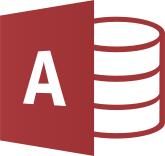

# Local file manager

**Classic ASP** application for managing and organizing some local files.

---

# Table of Contents

* [About the project](#about-the-project)
* [Setup](#setup)
    * [Turn on IIS](#turn-on-iis)
    * [Start IIS manager](#start-iis-manager)
    * [Create and configure the website](#create-and-configure-the-website)
* [Usage](#usage)
* [Screenshots](#screenshots)
* [License](#license)

# About the project

<table>
  <tr>
    <td>
        
    </td>
    <td>
        
    </td>
    <td>
        
    </td>
  </tr>
</table>

The purpose of this project was to play around with **Microsoft ASP** and **VBScript** to further improve my knowledge,
so I decided to build an application (in French) to organize some of my local files, in the glory time of **MP3s** and **DivX** :smiley: :pensive:

It includes a **Microsoft Access** database that stores the files data,
and then the application simply allows to consult / search / add / modify data (without modifying the underlying files).

The application was deployed in an **Internet Information Services** (IIS) web server on my **Windows XP** computer.

> [!Warning]
> This was never intended to be used in a production environment, it was just to play around with some of the involved technologies.
> Since I was learning, be indulgent, the code is neither clean nor secure :)

# Setup

Here are some information for a local installation (it can still run on **Windows 11** !).

### Turn on IIS

You first need to turn on **Internet Information Services** (IIS) on your Windows system.

Click the _Start_ button, click _Control Panel_, click _Programs_,
and then click _Turn Windows features on or off_,
check "Internet Information Services" to install the default features.

You also need to activate additional options to support Classic ASP :
expand _Application Development Features_ node and check _ASP_ and _ISAPI Extensions_.

To verify that IIS installed successfully, simply reach http://localhost in a web browser, the default IIS Welcome page should be displayed.

### Start IIS manager

**IIS Manager** enables you to configure Internet Information Services (IIS) that will run the application.

Click the _Start_ button, search for "IIS", it should found _Internet Information Services (IIS) Manager_, just Click to open it.

### Create and configure the website

In IIS manager, right clic _Sites_ and choose _Add a new website_, give it a name and select the source directory.
You can change the hostname and the port if needed, but this is not be required (the default website already runs on port `80`, so you may just choose port `81`).

Then simply start the website from the right panel.

You will probably get a `401.3 Unauthorized` error,

1. Navigate to the root of the web application
2. Right-click on the file and go to "Properties > Security"
3. Click "Edit" and then click "Add"
4. Click "Advanced" in the bottom left
5. Click "Find Now" - this should list all the accounts available
6. Scroll till you find "IUSR" and select it
7. Click "OK" and click "OK" again
8. In the block "Permissions for IUSR" click on "allow" next to "Full Control"
9. Click apply (wait for the dialog to close)
10. Click "OK" and click "OK" again

Then you will probably get another error if you run this on a 64 bits computer,
there are no 64-bit ODBC drivers, so on 64-bit systems you will have to run your applications in 32-bit mode. To do so, use the following steps:

1. On the taskbar, click Start, point to Administrative Tools, and then click Internet Information Services (IIS) Manager
2. In the Connections pane, click Application Pools.
3. Highlight the application pool for your application, then click Advanced Settings... in the Actions pane.
4. In the Advanced Settings dialog, specify True for Enable 32-Bit Applications.
5. Click OK to close the Advanced Settings dialog.

Last but not least, define the entrypoint of the application, go to _Default document_, right clic anywhere outside the list and choose _Add_,
then enter `mp3.asp` so that this will be the first page of the application (it should be the first value in the list).

You should be fine !

# Usage

Just start the IIS server and the website, then reach http://localhost:81 (if you run it on port `81`),
this should open the application in the `mp3.asp` page.

The application allows to :

- Manage MP3 files :
    - Sort them on each column (author, title, duration, style, date)
    - Filter the list either by first letter, or by style (Dance, RAP/R&B, etc.)
    - Add any entry by entering author, title, duration, style, size, date and local link
    - Modify data of any entry (author, title, duration, style, size, date, local link)
    - Listen to any entry through integrated audio player
    - Delete any entry
- Manage clip files (music video clips) :
    - Sort them on each column (author, title, duration, style)
    - Filter the list either by first letter, or by style (Dance, RAP/R&B, etc.)
    - Add any entry by entering author, title, duration, style, size, extension and local link
    - Modify data of any entry (author, title, duration, style, size, extension, local link)
    - Watch any entry through integrated video player
    - Delete any entry
- Manage DivX files (movies) :
    - Sort them on each column (title, duration, genre, size, extension, date)
    - Filter the list either by first letter, or by style (Horror, Action, etc.)
    - Add any entry by entering title, duration, genre, size, date, extension and local link
    - Modify data of any entry (title, duration, genre, size, date, extension, local link)
    - See the cover image by overing the magnifier icon
    - Delete any entry
- Manage games :
    - Sort them on each column (title, genre, number of CDs)
    - Filter the list either by first letter, or by style (Action, Racing, etc.)
    - Add any entry by entering title, genre, and number of CDs
    - Delete any entry
    - In this page you can choose the background color -_-

It also provides some information (current date and time, screen resolution), and some buttons with Javascript actions like back/next/bookmark/print/refresh.

# Screenshots

MP3 list (filtered by letter `N`) :

Clip list with the "add clip" functionality :

DivX list filtered by style (horror) :

Game list filtered by style (action) :

# License

[General Public License (GPL) v3](https://www.gnu.org/licenses/gpl-3.0.en.html)

This program is free software: you can redistribute it and/or modify it under the terms of the GNU
General Public License as published by the Free Software Foundation, either version 3 of the
License, or (at your option) any later version.

This program is distributed in the hope that it will be useful, but WITHOUT ANY WARRANTY; without
even the implied warranty of MERCHANTABILITY or FITNESS FOR A PARTICULAR PURPOSE. See the GNU
General Public License for more details.

You should have received a copy of the GNU General Public License along with this program. If not,
see <http://www.gnu.org/licenses/>.